# 📦 Bases de Datos Pedidos - Flask App


Aplicación web desarrollada con **Flask + MySQL** para la gestión y análisis de pedidos, implementando una arquitectura modular y escalable orientada a buenas prácticas de desarrollo backend.

---

## 🏗️ Arquitectura

El proyecto sigue el principio de **separación de responsabilidades**, facilitando mantenimiento y escalabilidad:


📁 project/
│
├── app.py # Punto de entrada principal
├── database.py # Gestión de conexión y consultas SQL
├── config.py # Configuración centralizada
│
├── fpreprocesamiento/ # Lógica de procesamiento de datos
├── templates/ # Capa de presentación (Jinja2 + SB Admin 2)
└── static/ # Recursos estáticos (CSS, JS, vendor)


---

## 🔍 Características Técnicas

- Uso de variables de entorno (`.env`)
- Conexión estructurada y reutilizable a MySQL
- Separación clara entre backend y frontend
- Implementación de dashboard administrativo
- Procesamiento modular de datos
- Estructura preparada para escalabilidad
- Buenas prácticas de organización en Flask

---

## 🧠 Stack Tecnológico

- Python 3.x
- Flask
- MySQL
- Jinja2
- HTML5 / CSS3 / Bootstrap
- Git & GitHub

---

## 🚀 Futuras mejoras

- Implementación de autenticación JWT
- Dockerización del proyecto
- Deployment en Render o Railway
- Implementación de API REST complementaria
- Tests automatizados con Pytest
- Integración con análisis avanzado de datos

---

## ⚙️ Instalación

```bash
git clone https://github.com/ingandresrincon99/bases-datos-pedidos-flask.git
cd bases-datos-pedidos-flask
pip install -r requirements.txt

Crear archivo .env:

DB_HOST=localhost
DB_USER=root
DB_PASSWORD=tu_password
DB_NAME=tu_base_de_datos

Ejecutar la aplicación:

python app.py
```
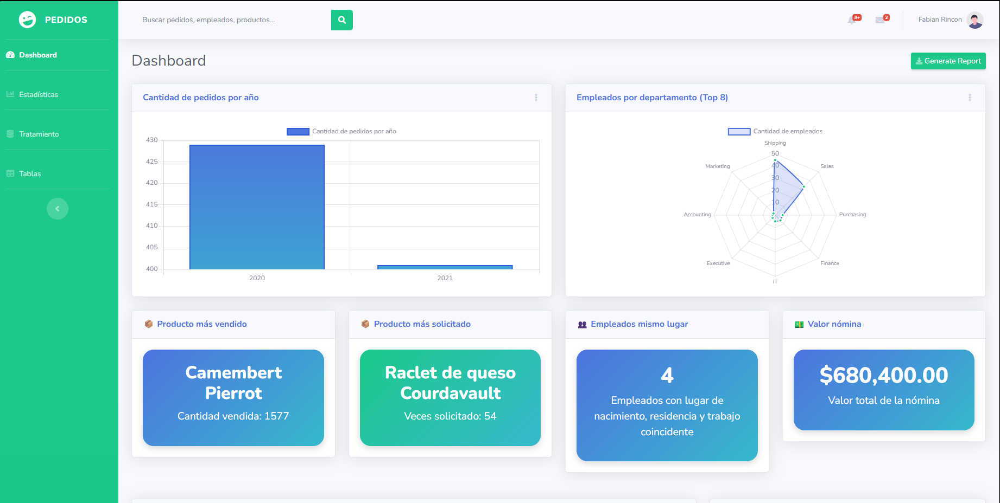
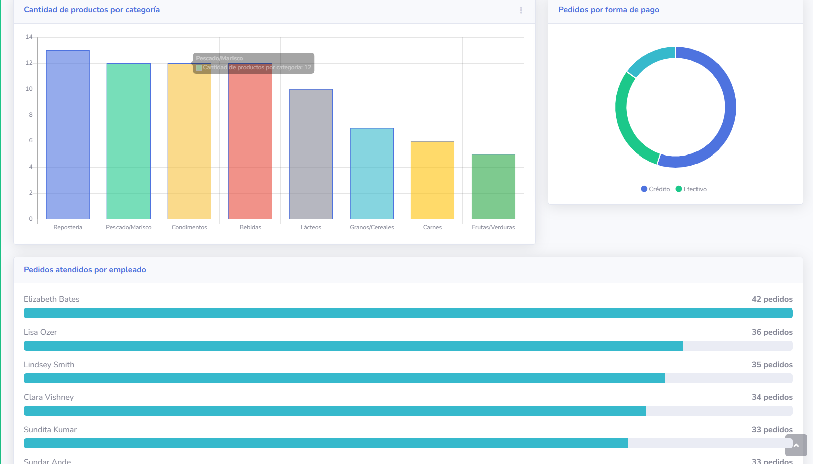
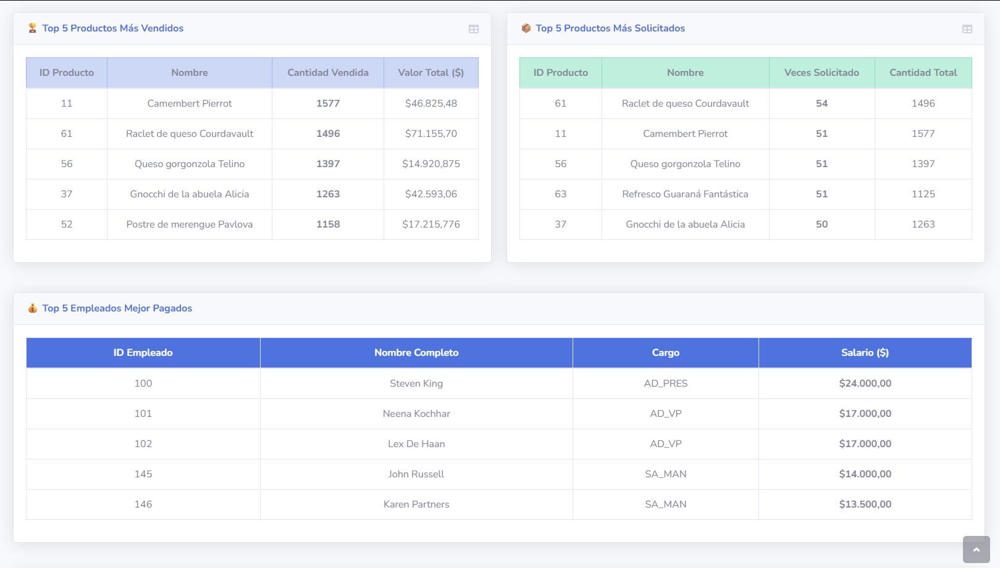
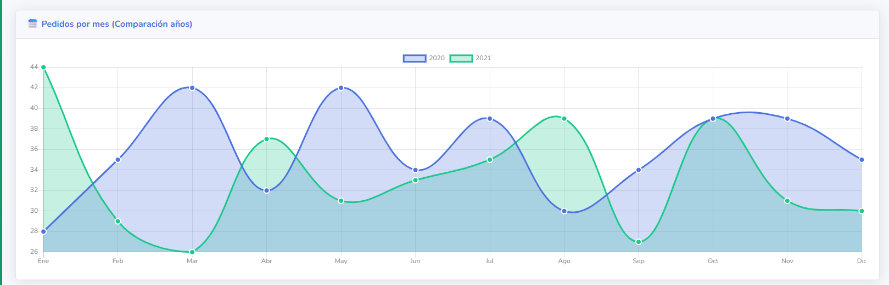
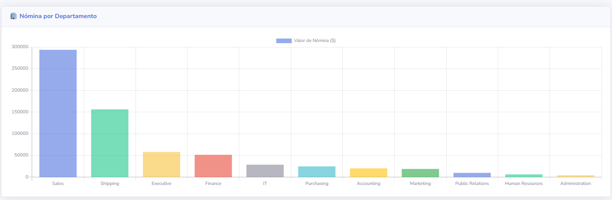
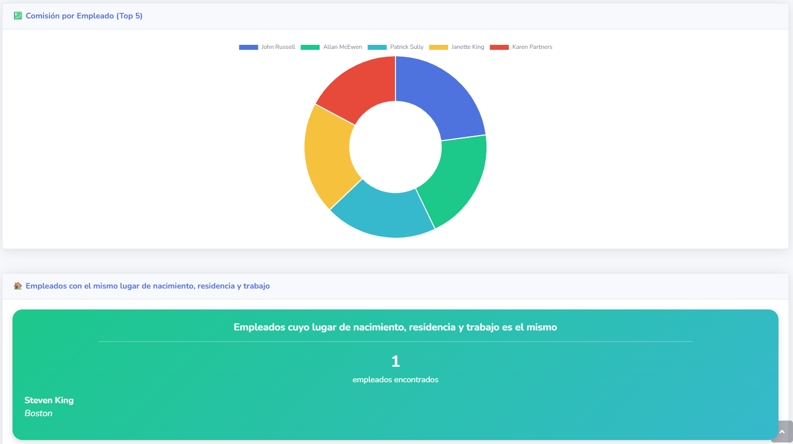

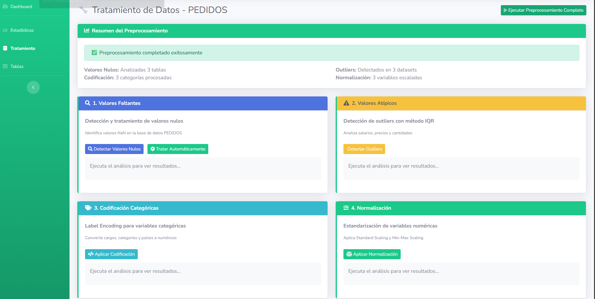
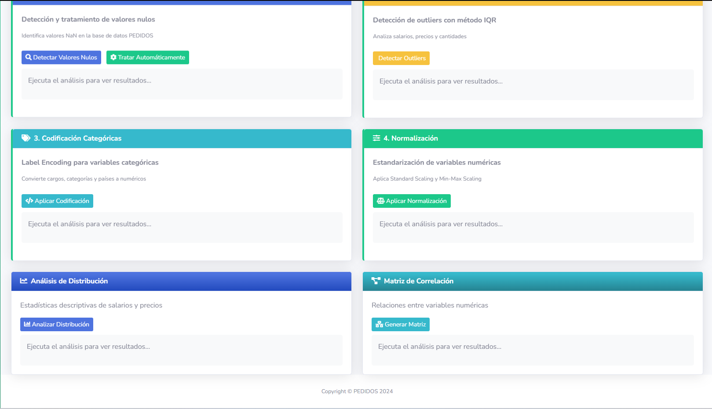

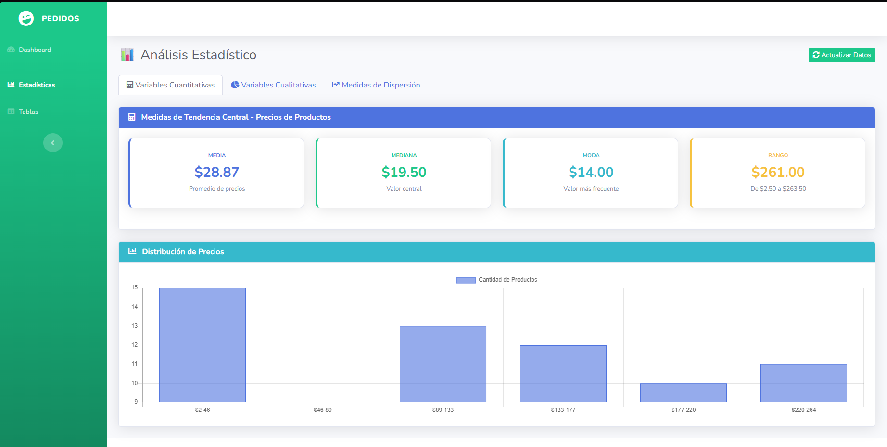
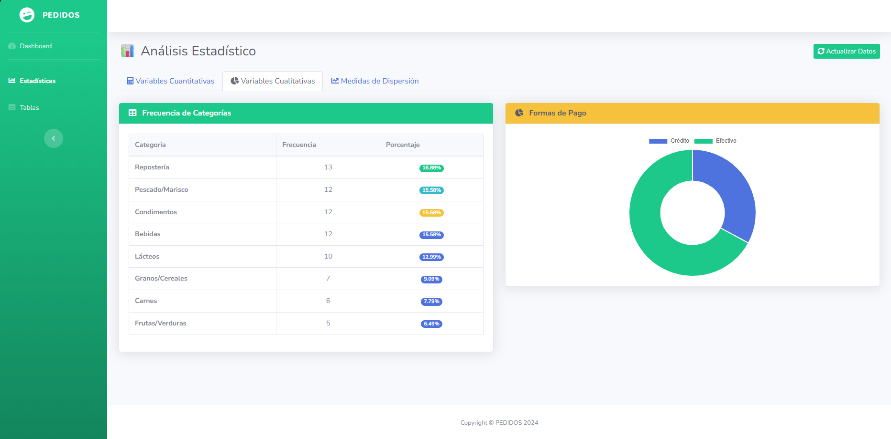
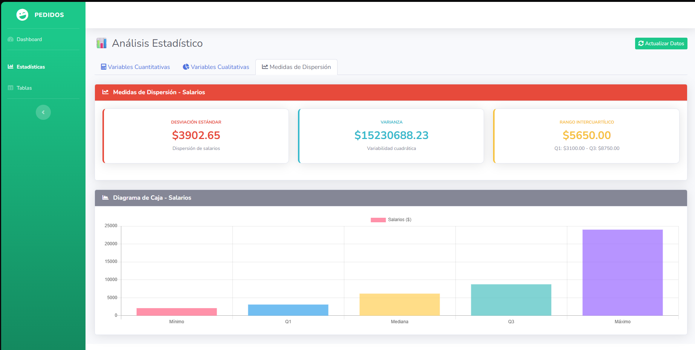

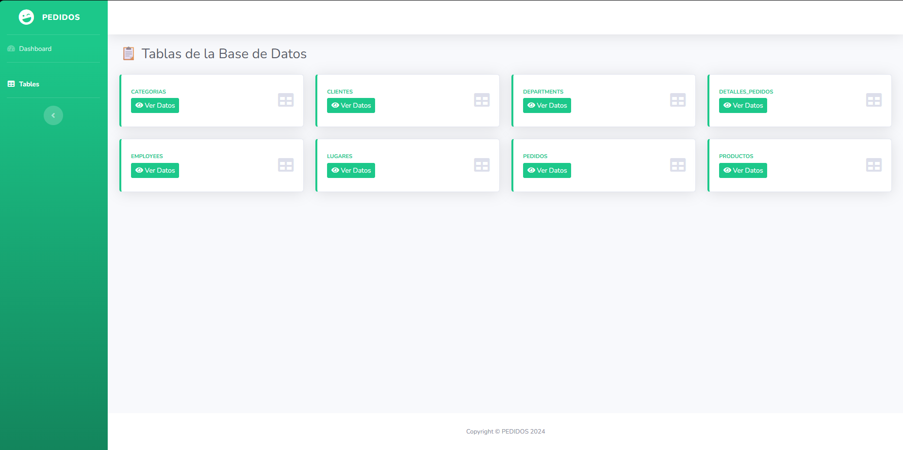
